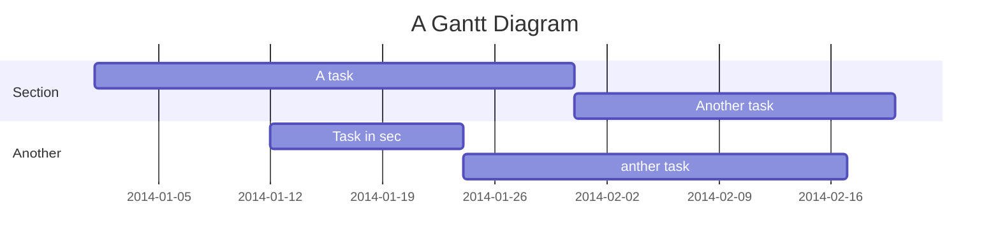

Simulated memory controller
===

Copyright lowRISC contributors.
Licensed under the Apache License, Version 2.0, see [LICENSE](https://github.com/lowRISC/gsoc-sim-mem/blob/master/LICENSE) for details. 
SPDX-License-Identifier: Apache-2.0

## Table of Contents

[TOC]

## Outline

This project has been initiated as a [Google Summer of Code](https::/summerofcode.withgoogle.com) 2020 project at lowRISC CIC.

As the gap between CPU and main memory frequency has dramatically increased in the past decades, a CPU typically interacts with a relatively slow main memory, which requires a considerable number of cycles to output data.

This is one reason why benchmarking a CPU core on a FPGA is a delicate task. As the soft core frequency is reduced compared to an ASIC implementation, its main memory may respond much faster than in typical ASIC operation. Additionally, there is no straightforward way to emulate a specific main memory configuration.

This project aims at responding to this demand.

## Features

The simulated memory controller, compatible with AXI 4, allows the user to slow down the interaction with the main memory and configure it with realistic delays. No changes are required neither in the real memory controller, nor in the CPU.

The simulated memory controller enforces response ordering per write AXI channel and read AXI channel, but treats read and write AXI identifiers independently. For example, a read request on a given AXI identifier can be answered after a subsequent write on the same AXI identifier, but must be answered earlier than any subsequent read request on the same AXI identifier.

## Overview

The simulated memory controller module is inserted between the *requester* (typically the CPU) and the (real) *memory controller*. 

<figure class="image">
  
  <figcaption>Fig: Simulated memory controller overview</figcaption>
</figure>

### Requests

The simulated memory controller transparently lets the requests (upward in the figure) pass from the requester to the memory controller. Only if some internal data structures are full, then the simulated memory controller may temporarily block some requests.

### Responses

The simulated memory controller is designed to emulate a memory controller, controlling a much slower memory than the one driven by the real memory controller behind it. Therefore, it is assumed that the responses are available from the real memory controller earlier than they should be released to the requester.

The responses are then stored in the simulated memory controller while waiting a certain calculated delay, after which they are released if the previous responses with the same AXI id have been released.

### Top-level overview

#### Top-level microarchitecture

The simulated memory controller is made of two major blocks:
* The delay calculator, which has as major responsibility to look at the request traffic and to deduce, according to the simulated memory controller parameters.

* The response banks, which have as major responsibilities to:
  a. Store the responses from the real memory controller until they can be released.
  b. Enforce the ordering per AXI identifier, letting the delay calculator be agnostic of the AXI identifier.

The delay calculator identifies address requests by internal identifiers (*iids*), which are not correlated with AXI identifiers.

TODO: Faire un diagramme

#### Top-level flow

The top-level flow happens as follows:
0. The response banks constantly advertise the identifier that will be allocated to the next address request.
1. When the address request comes in:
   * The delay calculator and the response banks are notified when an address request happens.
   * The delay calculator stores metadata for its delay computation.
   * The response banks reserve space for the corresponding responses that will subsequently come back from the real memory controller.
2. When the corresponding responses comes back from the real memory controller, they are stored by the 
3. When the delay enables the release of some response and all the previous responses of the same AXI are released, the response banks transmit the response to the requester.
4. When all the responses corresponding to a given address request have been transmitted to the requester, the response banks free the allocated memory for reuse.

TODO Faire un diagramme avec des flèches

## Response banks

The *simmem_resp_banks* module is made of two distinct *simmem_resp_bank* modules:
* The write response bank, responsible for storing write responses.
* The read data bank, responsible for storing read data. As read data can come back as burst data, this bank has to additionally support bursts, which is the essential difference with the write response bank.

The two banks act independently.

// TODO Faire un diagramme

### High-level design

Each response bank has a FIFO interface with reservations, and stores messages in RAMs. FIFOs are implemented as linked lists to make best use of the RAM space.

### Reservations

The reservation mechanism built in the response banks provides simultaneously two features:
1. It ensures that the responses to an address request will have space to be stored aas soon as they are produced. This prevents inflated delays between request address acceptation and its response in the case of congestion in the response banks. This also prevents any deadlock situation.
2. It provides internal identifiers, as soon as the address requests are made. This allows the delay calculator to immediately label the request metadata, for immediate processing. As the real memory controller may require multiple cycles to provide a response to an address request, producing an internal identifier as early as possible is a necessary feature.

### RAMs

Each response bank uses three RAM banks:
* *i_payload_ram*, responsible for storing the responses before they are transmitted to the requester. As there is one linked list per AXI identifier, the AXI identifier is not stored in the RAM, but deduced from its linked list identifier when it is released.
* *i_meta_ram_out_tail* and *i_meta_ram_out_head*, responsible for storing the linked list states: for each linked list element, they store the pointer to the next element in the payload RAM.

Two RAM banks are used to hold pointer to next elements, as three ports are needed (which is explained by the linked list implementation below). Their content is therefore maintained identical, but they may be read at different addresses simultaneously.

Using RAMs is efficient as it does not require a massive amount of flip-flops to store data, but incurs one cycle latency for the output.

### Extended RAM cells

Two options have been explored to store burst responses, while keeping a single internal identifier per address (and, therefore, per full burst of responses):
1. *In-width storage*: Storing all the responses corresponding to the same burst in the same physical RAM cell, using masks to write and retrieve them.
2. *In-depth storage*: Storing all the responses corresponding to the same burst in consecutive physical RAM cells.

The burst support has been implemented *in-depth*, because the block RAMs are typically narrow and deep, and do not always propose write masks, which makes in-width storage difficult.

The *MaxBurstLen* (maximum read burst length, or 1 for write responses) consecutive RAM cells dedicated to the same burst are referred to as *extended RAM cells*. On a high level, extended RAM cells are the elementary data structures in linked lists. BY opposition to extended RAM cells, the actual physical RAM cells are called *elementary RAM cells*.

We additionally introduce two address spaces:
* *address*: refers to the address of the extended cells, viewing them as elementary storage elements. This matches with addresses as defined by the metadata RAM.
* *full address*: refers to the full address of an elementary cell in the payload RAM. 

// TODO Diagramme.

Therefore, there are *MaxBurstLen* times as many elementary RAM cells in *i_payload_ram* than there are in each of *i_meta_ram_out_tail* and *i_meta_ram_out_head*.


### Linked list implementation

Linked lists enforce the ordering of the response release as defined by the AXI identifier.

#### Linked list pointers

Linked lists are logical structures maintained by the *i_meta_ram_out_tail* and *i_meta_ram_out_head* RAMs as well as four pointers:
* Reservation head (*rsv_heads_q*): Points to the most recently reserved extended cell.
* Response head (*rsp_heads*): Points to the next RAM address where a response of the corresponding AXI identifier will be stored.
* Pre_tail (*pre_tails*): Points to the second-to-last cell hosting or awaiting a response in the linked list.
* Tail (*tails*): Points to the oldest cell hosting or awaiting a response in the linked list.

The order of the pointers must always be respected. They can be equal but never overtake each other, in the order defined by the linked list.

Two distinct tail pointers are required to dynamically manage the two following cases:
* The pre_tail address is given as input to the payload RAM if there is a successful output handshake and the value at the output has an AXI id corresponding to the AXI id of the considered linked list. It must point to:
  * The second-to-last element of the linked list if the list contains two reponses or more,
  * The last element element of the linked list if the list contains just one response,
  * rsp_head if the list contains no responses.
* The tail address is given as input to the payload RAM in all other cases. This case disjunction prevents an output data from being output twice, and prevents any bandwidth drop at the output. It must point to:
  * The last element element of the linked list if the list contains one response or more,
  * pre_tail if the list contains no responses.

TODO Example diagramme


#### Lengths

In addition to the pointers, lengths of sub-segments of linked lists are stored to maintain the state of each linked lists, which is not fully defined by the four pointer and metadata RAMs only:
* *rsv_len*: Holds the number of extended cells that have been reserved, but have not received any response yet.
* *rsp_len*: Holds the number of extended cells that have received some response already, but are still active in the sense that they either still hold responses dedicated to the requester, or await additional response of a burst for which the extended cell has already received some responses but not all.

Additionally, another length is combinatorially inferred:
* *rsp_len_after_out*: Determines what will be *rsp_len*, considering the release of responses but not the acquisition of new data. This signal is helpful in many regular and corner cases as it helps to manage the latency cycle at the output.

#### Extended cell state

##### Internal counters

For each extended RAM cells, additional memory is dedicated to maintaining the extended RAM cell state:
* *rsv_cnt*: Counts the number of responses that are still awaited in the burst. When reserving an extended cell, this counter is set to the address request burst length. The counter is decremented every time a burst response is transmitted from this extended RAM cell to the requester.
* *burst_len*: Stores the burst length of the address request corresponding to this extended RAM cell.
* *rsp_cnt*: Counts the number of responses that are currently stored in the extended cell. The counter is incremented everytime a response is acquired and decremented everytime a response is released. 

An extended cell is said to be valid (*ram_v*) (in a terminology similar to a cache line for instance) if *rsv_cnt* is non-zero or *rsp_cnt* is non-zero.

##### Elementary cell offset

These three elements maintain full knowledge of the extended cell state and give the offset of an elementary RAM cell inside an extended cell:
* The offset for data output is given by $tail\_burst\_len - tail\_rsv\_cnt - tail\_rsv\_cnt$, which corresponds to the number of burst responses already released. The offset may be taken from the *pre_tail* instead of the *tail* in the cases described further above.
* The offset for data input is given by $rsp\_burst\_len - rsv\_cnt$, which corresponds to the number of burst responses already acquired (regardless of whether they have been already released).

#### Linked list detailed operation

A pointer *pA* is said to *piggyback* another pointer *pB* when we impose that *pA* takes the same value as *pB*.

##### Reservation

Reservation is possible if there is some non-valid extended cell in the payload RAM.
On reservation, the reservation head is

TODO Continuer ici

#### Piggybacking and corner cases

#### Additional features

##### Release enable double-check


TODO Document how to extend the scheduling strategy

TODO Ready signal harmonization.

TODO Integerate images properly

TODO: Mettre des compteurs par AXI ID.

TODO Explain that refreshing is not emulated.

TODO REMOVE BELOW

User story
---

```gherkin=
Feature: Guess the word

  # The first example has two steps
  Scenario: Maker starts a game
    When the Maker starts a game
    Then the Maker waits for a Breaker to join

  # The second example has three steps
  Scenario: Breaker joins a game
    Given the Maker has started a game with the word "silky"
    When the Breaker joins the Maker's game
    Then the Breaker must guess a word with 5 characters
```
> I choose a lazy person to do a hard job. Because a lazy person will find an easy way to do it. [name=Bill Gates]


```gherkin=
Feature: Shopping Cart
  As a Shopper
  I want to put items in my shopping cart
  Because I want to manage items before I check out

  Scenario: User adds item to cart
    Given I'm a logged-in User
    When I go to the Item page
    And I click "Add item to cart"
    Then the quantity of items in my cart should go up
    And my subtotal should increment
    And the warehouse inventory should decrement
```

> Read more about Gherkin here: https://docs.cucumber.io/gherkin/reference/

User flows
---
```sequence
Alice->Bob: Hello Bob, how are you?
Note right of Bob: Bob thinks
Bob-->Alice: I am good thanks!
Note left of Alice: Alice responds
Alice->Bob: Where have you been?
```

> Read more about sequence-diagrams here: http://bramp.github.io/js-sequence-diagrams/

Project Timeline
---


> Read more about mermaid here: http://mermaid-js.github.io/mermaid/

## Appendix and FAQ

:::info
**Find this document incomplete?** Leave a comment!
:::

###### tags: `Templates` `Documentation`
